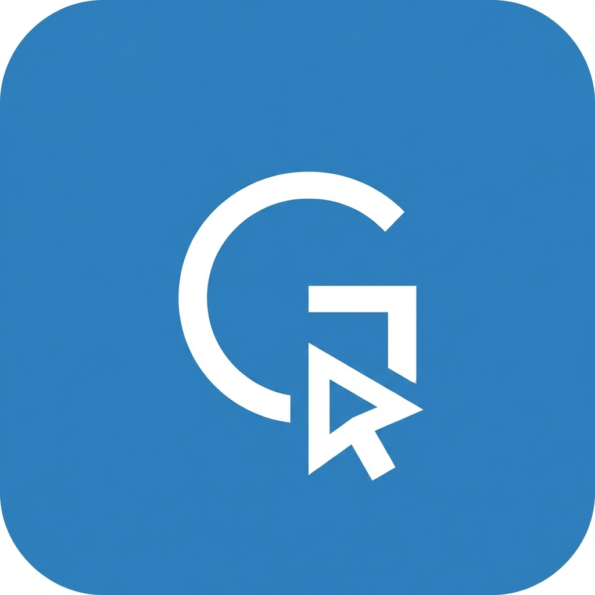

# Garvin Dholakiya - AI Workflow Expert & Full Stack Developer

<div align="center">
  
  <p><strong>Transforming Businesses with Intelligent AI Automation & Modern Web Solutions</strong></p>
</div>

---

## 🚀 About Me
I'm Garvin Dholakiya, a Software Engineer specialized in building smart automation systems and AI-powered agents. I bridge the gap between complex AI capabilities and practical business needs by creating end-to-end workflows that save time and reduce costs.

- 🤖 **AI Specialty:** Agentic Workflows, LangChain, RAG, OpenAI, n8n, Make.
- 💻 **Full Stack:** React, TypeScript, Node.js, Python, Laravel, FastAPI.
- 📈 **Goal:** Helping businesses automate the mundane to focus on the extraordinary.

## 🛠️ Tech Stack

### AI & Automation
- **Platforms:** n8n, Make.com, Zapier
- **AI Models:** GPT-4, Llama 3, Claude, Stable Diffusion
- **Tools:** LangChain, Pinecone, Vector Databases, Python (FastAPI)

### Web Development
- **Frontend:** React, Next.js, TypeScript, Tailwind CSS
- **Backend:** Node.js, Express, NestJS, PHP (Laravel, CodeIgniter)
- **Database:** PostgreSQL, MySQL, MongoDB, Redis

## 🌟 Featured Projects
- **Bulk SMS & Marketing Automation:** Scalable AI engagement platform using Twilio & n8n.
- **AI Bulk Image Generator:** High-speed workflow using Stable Diffusion & Midjourney APIs.
- **Intelligent Support Chatbot:** Context-aware RAG bot handling 80% of routine queries.
- **Enterprise LLM Assistant:** Secure, private internal productivity tool.

## ⚙️ Local Development

### Prerequisites
- Node.js (v18+)
- npm or yarn

### Steps
1. **Clone the repository:**
   ```bash
   git clone https://github.com/garvin6372/garvin-portfolio.git
   cd garvin-portfolio
   ```

2. **Install dependencies:**
   ```bash
   npm install
   ```

3. **Run the development server:**
   ```bash
   npm run dev
   ```

## 📬 Contact
- **Website:** [garvin.jinnityai.com](https://garvin.jinnityai.com/)
- **Email:** garvindholakiya511@gmail.com
- **LinkedIn:** [garvin-dholakiya](https://linkedin.com/in/garvin-dholakiya)

---
<div align="center">
  Developed by Garvin Dholakiya © 2024
</div>
